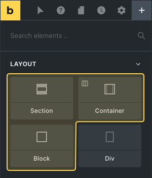

Bricks propose quatre blocs qui servent à la mise en page: 

- **Section**. A une largeur de 100%. Voir [documentation](https://academy.bricksbuilder.io/article/section-element/).
- **Container**. A une largeur maximale de 1100px.
- **Block**. A une largeur de 100%.
- **Div**. Pas de réglage particulier, c'est un simple DIV.

Voir l'article "[Understanding The Layout](https://academy.bricksbuilder.io/article/layout/)" dans la documentation officielle.

**Note:** la largeur sur le Container est définie en CSS avec `width`. Mais puisque nous sommes dans un contexte *Flexbox*, cela se comporte comme un `max-width`!

## Conseils

Pour les éléments *Section*, *Container*, *Block*: attention à ne jamais leur donner une valeur "margin" horizontale, cela ferait déborder votre mise en page!

## Définir la largeur maximum

La largeur par défaut de 1100px sur l'élément **Container** peut être **redéfinie** dans vos *Theme Styles*, pour correspondre à votre maquette.

