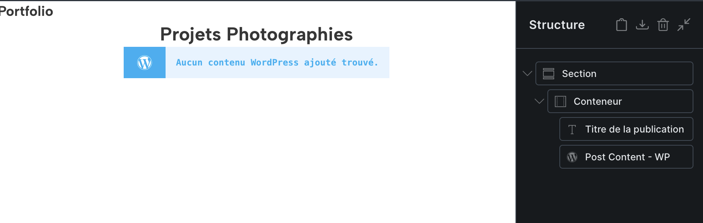

Attention, le travail avec Bricks peut comporter quelques pièges.

## Template des pages

En créant un Template simple pour les Pages, il est facile de commettre l'erreur suivante:

- Représenter le contenu avec un bloc **Post Content** (Contenu de la publication) ayant **WordPress** comme Data source (Source de donnés) uniquement.

Ce réglage fonctionne aussi longtemps que les pages sont éditées avec l'éditeur WordPress. Mais on rencontre un problème si l'on édite des pages avec Bricks. Le résultat: au lieu du contenu, un message d'erreur "Aucun contenu WordPress ajouté trouvé" s'affiche.

**La solution:** il faut ajouter un deuxième bloc **Post Content** ayant pour source de données: **Bricks**.

Une explication en vidéo: 
[Bricks and Gutenberg content in the SAME Template](https://www.youtube.com/watch?v=5uAd9UOzXqk)